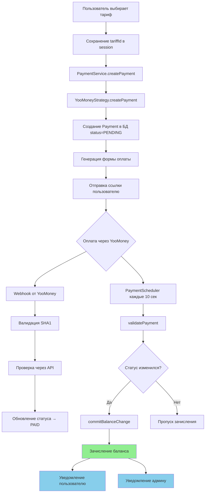

# Документация: Платёжная система

> **Дата обновления:** 2025-10-22
> **Версия:** 2.0
> **Статус:** Актуально для текущей версии проекта

## 📋 Содержание

1. [Общий обзор](#общий-обзор)
2. [Создание платежа](#создание-платежа)
3. [Проверка и зачисление](#проверка-и-зачисление)
4. [Автоматическое списание](#автоматическое-списание)
5. [Уведомления](#уведомления)
6. [Архитектура](#архитектура)
7. [Безопасность](#безопасность)

---

## Общий обзор

Платёжная система построена на принципах:
- **Strategy Pattern** - легко добавить новые платёжные системы
- **Scheduled Tasks** - автоматическая проверка и списание
- **Audit Trail** - полная история изменений баланса
- **Idempotency** - защита от двойного зачисления

### Поддерживаемые платёжные системы

На данный момент реализована только **YooMoney** (бывший Яндекс.Деньги):
- Приём платежей с российских карт (Visa, MasterCard, МИР)
- Webhook-уведомления
- SHA1 валидация платежей

---

## Создание платежа

### Пользовательский flow

```
START → HOME → GET_ACCESS → Выбор тарифа → PAYMENT → Оплата
```

### Шаг 1: Выбор тарифа

**Файлы:**
- [month-tariff.conversation.ts](../src/grammy/conversations/month-tariff.conversation.ts)
- [threemonth-tariff.conversation.ts](../src/grammy/conversations/threemonth-tariff.conversation.ts)
- [sixmonth-tariff.conversation.ts](../src/grammy/conversations/sixmonth-tariff.conversation.ts)

```typescript
// Сохранение выбранного тарифа в session
ctx.session.tariffId = 'MONTH_TARIFF';
await conversation.external(() =>
  ctx.conversation.enter(CommandEnum.PAYMENT)
);
```

### Шаг 2: Создание платежа

**Файл:** [payment.conversation.ts](../src/grammy/conversations/payment.conversation.ts)

```typescript
const payment = await paymentService.createPayment(
  userId,
  chatId,
  ctx.session.tariffId,
  PaymentSystemEnum.YOOMONEY
);

// Отправка ссылки пользователю
await ctx.reply(
  `💳 Ссылка для оплаты: ${process.env.DOMAIN}/payment/${payment.paymentId}`,
  { parse_mode: 'HTML' }
);
```

### Шаг 3: Генерация платёжной формы

**Файл:** [payment.service.ts](../src/payment/payment.service.ts)

```typescript
async createPayment(
  userId: number,
  chatId: number,
  tariffId: string,
  paymentSystem: PaymentSystemEnum
): Promise<Payment> {
  // 1. Получаем данные пользователя и тарифа
  const user = await this.userService.findOneByUserId(userId);
  const tariff = await this.tariffService.getOneById(tariffId);

  // 2. Используем Strategy Pattern
  const strategy = this.paymentStrategyFactory
    .createPaymentStrategy(paymentSystem);

  // 3. Создаём платёж через стратегию
  const payment = await strategy.createPayment({
    userId,
    chatId,
    tariffId,
    tariffPrice: tariff.price,
    paymentAt: DateTime.local().toJSDate(),
  });

  // 4. Сохраняем в БД со статусом PENDING
  return this.prisma.payment.create({ data: payment._payment });
}
```

### Шаг 4: YooMoney Strategy

**Файл:** [yoomoney-payment.strategy.ts](../src/payment/strategies/yoomoney-payment.strategy.ts)

```typescript
async createPayment(data: CreatePaymentData): Promise<PaymentProxy> {
  const paymentId = uuidv4();

  // Генерация HTML формы для YooMoney
  const form = this.generatePaymentForm(paymentId, data.tariffPrice);

  // Генерация redirect URL
  const url = `${this.domain}/payment/${paymentId}`;

  return {
    _payment: {
      paymentId,
      orderId: paymentId,
      status: PaymentStatusEnum.PENDING,
      paymentSystem: PaymentSystemEnum.YOOMONEY,
      userId: data.userId,
      chatId: data.chatId,
      tariffId: data.tariffId,
      amount: data.tariffPrice,
      paymentAt: data.paymentAt,
      paymentAmount: data.tariffPrice,
      paymentCurrency: 'RUB',
      url,
      form,
    }
  };
}
```

---

## Проверка и зачисление

### Метод 1: Автоматическая проверка (Scheduler)

**Файл:** [payment.scheduler.ts](../src/payment/payment.scheduler.ts)

```typescript
@Cron(CronExpression.EVERY_10_SECONDS)
async handlePendingPayments() {
  // Получаем все платежи со статусом PENDING
  const pendingPayments = await this.paymentService.getPendingPayments();

  for (const payment of pendingPayments) {
    try {
        // Проверяем и валидируем через сервис (включает уведомления)
        await this.paymentService.validatePayment(payment.paymentId);
    } catch (e) {
        // Log error
    }
  }
}
```

### Метод 2: Webhook от YooMoney

**Файл:** [payment.controller.ts](../src/payment/payment.controller.ts)

```typescript
@Post('yoomoney/notification')
async yooMoneyNotification(@Body() notification: YooMoneyNotification) {
  const isValid = await this.paymentService.yooMoneyWebHook(notification);
  return { success: isValid };
}
```

**Валидация webhook:** [payment.service.ts](../src/payment/payment.service.ts)

```typescript
async yooMoneyWebHook(notification: YooMoneyNotification): Promise<boolean> {
  const secret = this.configService.get('YOOMONEY_SECRET');

  // 1. Проверка SHA1 подписи
  const hashString = [
    notification.notification_type,
    notification.operation_id,
    notification.amount,
    notification.currency,
    notification.datetime,
    notification.sender,
    notification.codepro,
    secret,
    notification.label,
  ].join('&');

  const calculatedHash = createHash('sha1')
    .update(hashString)
    .digest('hex');

  if (calculatedHash !== notification.sha1_hash) {
    return false; // Подпись не совпадает
  }

  // 2. Дополнительная проверка через API
  const operationDetails = await this.yooMoney.getOperationDetails(
    notification.operation_id
  );

  if (
    operationDetails.operation_id === notification.operation_id &&
    operationDetails.amount === parseFloat(notification.amount) &&
    operationDetails.sender === notification.sender &&
    operationDetails.label === notification.label
  ) {
    // Обновляем статус платежа
    await this.updatePaymentStatus(
      notification.label,
      PaymentStatusEnum.PAID,
      true
    );
    return true;
  }

  return false;
}
```

### Логика зачисления баланса

**Файл:** [payment.service.ts](../src/payment/payment.service.ts)

```typescript
async validatePayment(paymentId: string): Promise<boolean> {
  const payment = await this.findPaymentByPaymentId(paymentId);

  const strategy = this.paymentStrategyFactory
    .createPaymentStrategy(PaymentSystemEnum[payment.paymentSystem]);

  const paymentStatus = await strategy.validateTransaction(payment.paymentId);
  const isPaid = paymentStatus === PaymentStatusEnum.PAID;

  if (isPaid) {
    // ⚠️ ВАЖНО: Зачисляем баланс ТОЛЬКО при изменении статуса
    if (paymentStatus !== payment.status) {
      const user = await this.userService.findOneByUserId(payment.userId);
      const tariff = await this.tariffService.getOneById(payment.tariffId);

      if (user) {
        await this.userService.commitBalanceChange(
          user,
          tariff.price,
          BalanceChangeTypeEnum.PAYMENT,
          paymentId
        );
      }
    }

    await this.updatePaymentStatus(paymentId, PaymentStatusEnum.PAID, isPaid);
  }

  return isPaid;
}
```

### Защита от двойного зачисления

```typescript
// ✅ Проверка в validatePayment:
if (paymentStatus !== payment.status) {
  // Зачисляем баланс ТОЛЬКО при изменении статуса на PAID
  await this.userService.commitBalanceChange(...);
}
```

**Файл:** [user.service.ts](../src/user/user.service.ts)

```typescript
async commitBalanceChange(
  user: User,
  change: number,
  type: BalanceChangeTypeEnum,
  paymentId?: string
): Promise<BalanceChange> {
  // Проверяем достаточность средств
  const status: BalanceChangeStatusEnum =
    (user.balance + change) <= 0
      ? BalanceChangeStatusEnum.INSUFFICIENT
      : BalanceChangeStatusEnum.DONE;

  // Создаём запись в BalanceChange (audit trail)
  const balanceEntry = {
    userId: user.userId,
    changeAmount: change,
    paymentId: paymentId,
    balance: user.balance,
    type: BalanceChangeTypeEnum[type],
    status: status,
  };

  return this.prisma.balanceChange.create({ data: balanceEntry })
    .then(async balanceChange => {
      // Обновляем баланс ТОЛЬКО если статус = DONE
      if (status == BalanceChangeStatusEnum.DONE) {
        await this.updateUser({
          where: { userId: user.userId },
          data: {
            balance: user.balance + balanceChange.changeAmount
          }
        });
      }
      return balanceChange;
    });
}
```

---

## Автоматическое списание

### Ежедневное списание

**Файл:** [payment.scheduler.ts](../src/payment/payment.scheduler.ts)

```typescript
@Cron(CronExpression.EVERY_DAY_AT_MIDNIGHT)
async handleMidnight() {
  const serviceFee = this.botService.minimumBalance; // из .env

  // Получаем только пользователей с балансом >= serviceFee
  const users = await this.userService.usersWithBalance(serviceFee);

  for (const user of users) {
    const balanceChange = await this.userService.commitBalanceChange(
      user,
      -serviceFee, // отрицательное значение = списание
      BalanceChangeTypeEnum.SCHEDULER
    );

    // Отправляем уведомление если баланс недостаточен
    if (balanceChange.status == BalanceChangeStatusEnum.INSUFFICIENT) {
      await this.botService.sendInsufficientChargeMessage(
        user.chatId,
        user.balance,
        balanceChange.changeAmount
      );
    }
  }
}
```

### Конфигурация

```env
MINIMUM_BALANCE=3  # Сумма ежедневного списания в рублях
```

---

## Уведомления

### 1. Успешная оплата (пользователю)

**Файл:** [bot.service.ts](../src/grammy/bot.service.ts)

```typescript
async sendPaymentSuccessMessage(
  chatId: number,
  balance: number
): Promise<void> {
  const balanceFormatted = balance.toLocaleString('ru-RU', {
    style: 'currency',
    currency: 'RUB',
  });

  await this.sendMessage(
    chatId,
    `✅ Баланс успешно пополнен!\n💰 Текущий баланс: ${balanceFormatted}`
  );
}
```

### 2. Успешная оплата (админам)

```typescript
### 2. Успешная оплата (админам)

Уведомления отправляются всем администраторам, зарегистрированным в базе данных (таблица `AdminUser`) с привязанным `telegramId`.

**Файл:** [payment.service.ts](../src/payment/payment.service.ts)

```typescript
private async notifyAdmins(transaction: Transaction, username: string) {
  // Получаем всех админов
  const admins = await this.prisma.adminUser.findMany({
    where: { telegramId: { not: null } }
  });

  const message = `💰 <b>Новая оплата!</b>\n...`;

  for (const admin of admins) {
     // Отправляем сообщение каждому админу
     await this.grammyService.bot.api.sendMessage(Number(admin.telegramId), message, { parse_mode: 'HTML' });
  }
}
```

### 3. Недостаточный баланс

```typescript
async sendInsufficientChargeMessage(
  chatId: number,
  balance: number,
  change: number
): Promise<void> {
  const balanceCurrency = balance.toLocaleString('ru-RU', {
    style: 'currency',
    currency: 'RUB',
  });
  const changeCurrency = Math.abs(change).toLocaleString('ru-RU', {
    style: 'currency',
    currency: 'RUB',
  });

  await this.sendMessage(
    chatId,
    `⚠️ Недостаточно средств для списания ${changeCurrency}\n\n` +
    `💰 Текущий баланс: ${balanceCurrency}\n` +
    `💳 Пожалуйста, пополните баланс`
  );
}
```

---

## Архитектура

### Strategy Pattern

```
PaymentService
    ↓
PaymentStrategyFactory
    ↓
PaymentStrategy (interface)
    ├── YooMoneyPaymentStrategy
    ├── (Future) StripePaymentStrategy
    └── (Future) CryptoPaymentStrategy
```

### Database Models

```prisma
// Платёж
model Payment {
  paymentId       String   @id        // UUID платежа
  status          String              // PENDING | PAID | FAILED | CANCELED
  paymentSystem   String              // YOOMONEY | ...
  userId          Int                 // ID пользователя
  tariffId        String              // ID тарифа
  amount          Int                 // Сумма платежа
  paymentAt       DateTime            // Дата создания
  transactionId   String?             // ID транзакции в платёжной системе
  // ...
}

// История изменений баланса
model BalanceChange {
  id           Int      @id
  userId       Int                    // Пользователь
  paymentId    String?                // Связь с платежом (если есть)
  balance      Int                    // Баланс ДО изменения
  changeAmount Int                    // Сумма изменения (+/-)
  type         String                 // PAYMENT | MANUALLY | SCHEDULER
  status       String                 // DONE | INSUFFICIENT
  changeAt     DateTime               // Timestamp
}
```

### Cron Schedule

| Task | Schedule | Назначение |
|------|----------|------------|
| `handlePendingPayments()` | Каждые 10 секунд | Проверка статуса pending платежей |
| `handleMidnight()` | Каждую полночь | Списание ежедневной платы |

---

## Безопасность

### Реализованные меры

1. **SHA1 валидация webhook**
   - Проверка подписи от YooMoney
   - Защита от поддельных уведомлений

2. **Двойная проверка платежа**
   - Webhook уведомление
   - Дополнительный запрос к API YooMoney

3. **Защита от двойного зачисления**
   - Проверка изменения статуса
   - Idempotency key (paymentId)

4. **Audit trail**
   - Полная история в BalanceChange
   - Сохранение баланса до и после изменения

5. **Admin-only операции**
   - Проверка ADMIN_CHAT_ID для команд `/up` и `/tariff`

### Рекомендации

1. **Rate limiting** для webhook endpoints
2. **IP whitelist** для YooMoney webhook
3. **Monitoring** для подозрительных транзакций
4. **Alerts** при ошибках зачисления

---

## Диаграмма полного flow



---

## Файлы проекта

### Core Services
- [payment.service.ts](../src/payment/payment.service.ts) - Основной сервис платежей
- [user.service.ts](../src/user/user.service.ts) - Управление балансом
- [tariff.service.ts](../src/tariff/tariff.service.ts) - Управление тарифами

### Strategies
- [payment-strategy.interface.ts](../src/payment/strategies/payment-strategy.interface.ts)
- [yoomoney-payment.strategy.ts](../src/payment/strategies/yoomoney-payment.strategy.ts)
- [payment-strategy.factory.ts](../src/payment/strategies/factory/payment-strategy.factory.ts)

### Schedulers
- [payment.scheduler.ts](../src/payment/payment.scheduler.ts)

### Bot
- [bot.service.ts](../src/grammy/bot.service.ts) - Уведомления
- [payment.conversation.ts](../src/grammy/conversations/payment.conversation.ts)
- [get-access.conversation.ts](../src/grammy/conversations/get-access.conversation.ts)
- Tariff conversations: month-tariff, threemonth-tariff, sixmonth-tariff

### Controllers
- [payment.controller.ts](../src/payment/payment.controller.ts) - Webhook endpoint

---

## Переменные окружения

```env
# YooMoney
YOOMONEY_SECRET=your_yoomoney_secret_key
YOOMONEY_SUCCESS_URL=https://your-domain.com/payment/success

# Админы
ADMIN_CHAT_ID=123456789
ADMIN_CHAT_ID_2=987654321

# Конфигурация
MINIMUM_BALANCE=3
DOMAIN=https://your-domain.com
```

---

## Заключение

Платёжная система реализована с учётом best practices:

✅ **Надёжность** - двойная проверка платежей
✅ **Безопасность** - валидация webhook, защита от replay attacks
✅ **Расширяемость** - Strategy Pattern для новых платёжных систем
✅ **Прозрачность** - полный audit trail в BalanceChange
✅ **Автоматизация** - cron jobs для проверки и списания

Система готова к production использованию.
