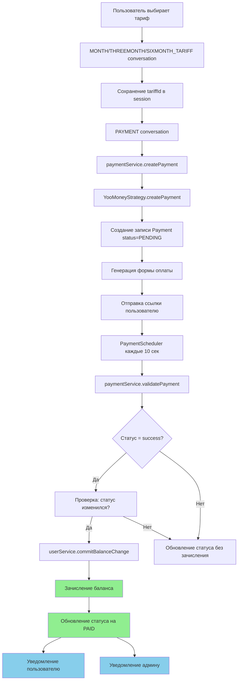

# 💳 Документация: Логика платежей и баланса

> **Дата создания:** 2025-10-21
> **Версия:** 1.0
> **Статус:** Актуально для grammY версии

## 📋 Содержание

1. [Создание платежа (YooMoney)](#1-создание-платежа-yoomoney)
2. [Проверка и зачисление платежа](#2-проверка-и-зачисление-платежа)
3. [Логика зачисления баланса](#3-логика-зачисления-баланса)
4. [Списание баланса (ежедневно)](#4-списание-баланса-ежедневно)
5. [Проверка баланса при подключении](#5-проверка-баланса-при-подключении)
6. [Уведомления](#6-уведомления)
7. [Итоговые выводы](#итоговые-выводы)

---

## 1. 💳 Создание платежа (YooMoney)

### Флоу пользователя:
```
START → HOME → GET_ACCESS → выбор тарифа (MONTH/THREEMONTH/SIXMONTH) → PAYMENT → оплата
```

### Детальная логика:

#### 1.1 Выбор тарифа
**Файлы:**
- [src/grammy/conversations/month-tariff.conversation.ts](../src/grammy/conversations/month-tariff.conversation.ts)
- [src/grammy/conversations/threemonth-tariff.conversation.ts](../src/grammy/conversations/threemonth-tariff.conversation.ts)
- [src/grammy/conversations/sixmonth-tariff.conversation.ts](../src/grammy/conversations/sixmonth-tariff.conversation.ts)

```typescript
// Сохраняет ID тарифа в сессию
ctx.session.tariffId = 'MONTH_TARIFF';
await conversation.external(() => ctx.conversation.enter(CommandEnum.PAYMENT));
```

✅ **Корректно:** Тариф сохраняется в session для использования в PAYMENT conversation

---

#### 1.2 Создание платежа
**Файл:** [src/grammy/conversations/payment.conversation.ts:69-84](../src/grammy/conversations/payment.conversation.ts#L69-L84)

**Процесс:**
1. Получает `tariffId` из сессии
2. Вызывает `paymentService.createPayment()` → [src/payment/payment.service.ts:42-71](../src/payment/payment.service.ts#L42-L71)
3. Создается запись в БД со статусом `PENDING`
4. Генерируется форма оплаты YooMoney → [src/payment/strategies/yoomoney-payment.strategy.ts:17-40](../src/payment/strategies/yoomoney-payment.strategy.ts#L17-L40)
5. Возвращается URL для оплаты: `${DOMAIN}/payment/${paymentId}`

**Код создания платежа:**
```typescript
// src/payment/payment.service.ts
async createPayment(
  userId: number,
  chatId: number,
  tariffId: string,
  paymentSystem: PaymentSystemEnum,
  paymentAt?: Date,
): Promise<Payment> {
  const user = await this.userService.findOneByUserId(userId);
  if (!user) throw new Error('User not found');

  const tariff: Tariff = await this.tariffService.getOneById(tariffId);
  if (!tariff) throw new Error(`Tariff with id ${tariffId} not found`);

  const paymentStrategy = this.paymentStrategyFactory.createPaymentStrategy(paymentSystem);
  const payment = await paymentStrategy.createPayment({
    userId,
    chatId,
    tariffId,
    tariffPrice: tariff.price,
    paymentAt: paymentAt || DateTime.local().toJSDate(),
  });

  return this.prisma.payment.create({data: payment._payment})
}
```

✅ **Корректно:** Полная цепочка создания платежа работает

---

## 2. ✅ Проверка и зачисление платежа

### 2.1 Автоматическая проверка (каждые 10 секунд)
**Файл:** [src/payment/payment.scheduler.ts:40-72](../src/payment/payment.scheduler.ts#L40-L72)

```typescript
@Cron(CronExpression.EVERY_10_SECONDS)
async handlePendingPayments() {
  const pendingPayments = await this.paymentService.getPendingPayments();

  for (const payment of pendingPayments) {
    const isPaid = await this.paymentService.validatePayment(payment.paymentId);

    if (isPaid) {
      const user = await this.userService.findOneByUserId(payment.userId);
      await this.botService.sendPaymentSuccessMessage(payment.chatId, user.balance);
      await this.botService.sendPaymentSuccessMessageToAdmin(
        user.username,
        user.balance,
        payment.amount,
        PaymentSystemEnum[payment.paymentSystem],
      );
    }
  }
}
```

**Процесс валидации:** [src/payment/payment.service.ts:85-113](../src/payment/payment.service.ts#L85-L113)
```typescript
async validatePayment(paymentId: string): Promise<boolean> {
  const payment = await this.findPaymentByPaymentId(paymentId);
  if (!payment) throw new Error(`Payment with id ${paymentId} not found`);

  const paymentStrategy = this.paymentStrategyFactory.createPaymentStrategy(
    PaymentSystemEnum[payment.paymentSystem]
  );

  const paymentStatus = await paymentStrategy.validateTransaction(payment.paymentId);
  const isPaid = paymentStatus === PaymentStatusEnum.PAID;

  if(isPaid) {
    if(paymentStatus !== payment.status) { // Зачисление ТОЛЬКО при изменении статуса
      const user = await this.userService.findOneByUserId(payment.userId);
      const tariff = await this.tariffService.getOneById(payment.tariffId);
      if(user) {
        await this.userService.commitBalanceChange(
          user,
          tariff.price,
          BalanceChangeTypeEnum.PAYMENT,
          paymentId
        )
      }
    }
    await this.updatePaymentStatus(paymentId, PaymentStatusEnum.PAID, isPaid);
  } else {
    if (paymentStatus !== payment.status) {
      await this.updatePaymentStatus(paymentId, paymentStatus, isPaid);
    }
  }

  return isPaid;
}
```

✅ **Корректно:** Платеж проверяется автоматически, баланс зачисляется один раз

---

### 2.2 Webhook от YooMoney (дополнительная проверка)
**Файл:** [src/payment/payment.service.ts:121-161](../src/payment/payment.service.ts#L121-L161)

```typescript
async yooMoneyWebHook({
  operation_id,
  notification_type,
  datetime,
  sha1_hash,
  sender,
  codepro,
  currency,
  amount,
  label,
}: YooMoneyNotification): Promise<boolean> {
  const secret = this.configService.get('YOOMONEY_SECRET');

  // 1. Проверка подписи SHA1
  const hashString = [
    notification_type,
    operation_id,
    amount,
    currency,
    datetime,
    sender,
    codepro,
    secret,
    label,
  ].join('&');
  const calculatedHash = createHash('sha1').update(hashString).digest('hex');

  if (calculatedHash !== sha1_hash) return false;

  // 2. Дополнительная проверка через API
  const operationDetails = await this.yooMoney.getOperationDetails(operation_id);
  if (
    operationDetails.operation_id === operation_id &&
    operationDetails.amount === parseFloat(amount) &&
    operationDetails.sender === sender &&
    operationDetails.label === label
  ) {
    await this.updatePaymentStatus(label, PaymentStatusEnum.PAID, true);
    return true;
  }

  return false;
}
```

✅ **Корректно:** Есть webhook для мгновенного обновления статуса с проверкой подписи

---

## 3. 💰 Логика зачисления баланса

**Файл:** [src/user/user.service.ts:62-87](../src/user/user.service.ts#L62-L87)

```typescript
async commitBalanceChange(
  user: User,
  change: number,
  type: BalanceChangeTypeEnum,
  paymentId?: string
): Promise<BalanceChange> {

  // Проверка достаточности средств
  const status: BalanceChangeStatusEnum =
    (user.balance + change) <= 0 ?
      BalanceChangeStatusEnum.INSUFFICIENT :
      BalanceChangeStatusEnum.DONE

  // Создание записи в BalanceChange
  const balanceEntry: Prisma.BalanceChangeCreateInput = {
    userId: user.userId,
    changeAmount: change,
    paymentId: paymentId,
    balance: user.balance,
    type: BalanceChangeTypeEnum[type],
    status: status,
  }

  return this.prisma.balanceChange.create({data: balanceEntry}).then(async balanceChange => {
    // Обновление баланса ТОЛЬКО если статус = DONE
    if (status == BalanceChangeStatusEnum.DONE) {
      await this.updateUser({
        where: {userId: user.userId},
        data: {
          balance: user.balance + balanceChange.changeAmount
        }
      })
    }
    return balanceChange
  })
}
```

### Защита от двойного зачисления:
✅ **Проверка в validatePayment:** [src/payment/payment.service.ts:96](../src/payment/payment.service.ts#L96)
```typescript
if(paymentStatus !== payment.status) { // Зачисляет ТОЛЬКО при изменении статуса на PAID
  await this.userService.commitBalanceChange(user, tariff.price, ...);
}
```

✅ **Корректно:** Баланс зачисляется ОДИН РАЗ при переходе в статус PAID

---

## 4. 💸 Списание баланса (ежедневно)

**Файл:** [src/payment/payment.scheduler.ts:23-38](../src/payment/payment.scheduler.ts#L23-L38)

```typescript
@Cron(CronExpression.EVERY_DAY_AT_MIDNIGHT)
async handleMidnight() {
  const serviceFee = this.botService.minimumBalance; // Дневная плата
  const users = await this.userService.usersWithBalance(serviceFee); // Пользователи с балансом >= serviceFee

  for (const user of users) {
    await this.userService.commitBalanceChange(
      user,
      -serviceFee,
      BalanceChangeTypeEnum.SCHEDULER
    )
    .then(async balanceChange => {
      if(balanceChange.status == BalanceChangeStatusEnum.INSUFFICIENT) {
        // Уведомление о недостаточном балансе
        await this.botService.sendInsufficientChargeMessage(
          user.chatId,
          user.balance,
          balanceChange.changeAmount
        );
      }
    });
  }
}
```

### Особенности:
- ⏰ **Частота:** Каждый день в полночь (`EVERY_DAY_AT_MIDNIGHT`)
- 💰 **Сумма списания:** `minimumBalance` (из конфигурации)
- 🎯 **Целевые пользователи:** Только с балансом >= `serviceFee`
- 📨 **Уведомления:** Отправляются при недостаточном балансе

✅ **Корректно:**
- Списывает каждые сутки в полночь
- Списывает только у пользователей с достаточным балансом
- Уведомляет при недостаточном балансе

---

## 5. 🔌 Проверка баланса при подключении

**Файл:** [src/grammy/conversations/connect.conversation.ts:28-40](../src/grammy/conversations/connect.conversation.ts#L28-L40)

```typescript
const user = await userService.findOneByUserId(userId);

// Проверка баланса
if (user.balance <= botService.minimumBalance) {
  await ctx.reply('❌ Недостаточно средств для создания подключения. Пополните баланс.');
  await conversation.external(() => ctx.conversation.enter(CommandEnum.GET_ACCESS));
  return; // Перенаправление на пополнение баланса
}

// Создание подключения
connection = await outlineService.createConnection(userId, 'OpenPNBot');
```

✅ **Корректно:** Не позволяет создать подключение при недостаточном балансе

⚠️ **Потенциальное улучшение:** Используется `<=` вместо `<`. При балансе равном `minimumBalance` подключение не создается. Возможно, стоит изменить на `<`.

---

## 6. 📨 Уведомления

### 6.1 Успешная оплата пользователю
**Файл:** [src/grammy/bot.service.ts:89-91](../src/grammy/bot.service.ts#L89-L91)

```typescript
async sendPaymentSuccessMessage(chatId: number, balance: number): Promise<void> {
  await this.sendMessage(chatId, `Баланс успешно пополнен до ${balance} 🎉 \n\n`);
}
```

### 6.2 Успешная оплата админу
**Файл:** [src/grammy/bot.service.ts:96-114](../src/grammy/bot.service.ts#L96-L114)

```typescript
async sendPaymentSuccessMessageToAdmin(
  username: string,
  balance: number,
  amount: number,
  paymentSystem: PaymentSystemEnum,
): Promise<void> {
  const adminIds = [this.adminChatId, this.adminChatId2].filter(Boolean);

  for (const adminId of adminIds) {
    try {
      await this.grammyService.bot.api.sendMessage(
        adminId,
        `Пользователь ${username} оплатил, его баланс ${balance}. ` +
        `Оплаченная сумма: ${amount}. Платежная система ${paymentSystem} 🎉`,
      );
    } catch (error) {
      this.logger.error(`Failed to send admin notification to ${adminId}:`, error);
    }
  }
}
```

✅ **Корректно:**
- Уведомления отправляются двум админам
- Есть обработка ошибок
- Фильтруются пустые ID админов

### 6.3 Недостаточный баланс
**Файл:** [src/grammy/bot.service.ts:67-84](../src/grammy/bot.service.ts#L67-L84)

```typescript
async sendInsufficientChargeMessage(
  chatId: number,
  balance: number,
  change: number,
): Promise<void> {
  const balanceCurrency = balance.toLocaleString('ru-RU', {
    style: 'currency',
    currency: 'RUB',
  });
  const changeCurrency = change.toLocaleString('ru-RU', {
    style: 'currency',
    currency: 'RUB',
  });

  await this.sendMessage(
    chatId,
    `Требуется пополнить баланс для списания ${changeCurrency}\n\n` +
    `Текущий баланс: ${balanceCurrency}\n\n`,
  );
}
```

✅ **Корректно:** Уведомление о недостатке средств с форматированием валюты

---

## 🎯 Итоговые выводы

### ✅ Что работает корректно:

| Компонент | Статус | Комментарий |
|-----------|--------|-------------|
| **Создание платежа** | ✅ | Полная цепочка через conversation → service → strategy |
| **Генерация ссылки YooMoney** | ✅ | Форма генерируется, URL создается |
| **Проверка платежа** | ✅ | Автоматически каждые 10 секунд + webhook |
| **Зачисление баланса** | ✅ | Однократное зачисление при смене статуса на PAID |
| **Защита от двойного зачисления** | ✅ | Проверка `paymentStatus !== payment.status` |
| **Списание каждые сутки** | ✅ | Cron job в полночь |
| **Проверка баланса при подключении** | ✅ | Редирект на GET_ACCESS если баланс недостаточен |
| **Уведомления** | ✅ | Пользователю, админу, при недостатке средств |

### ⚠️ Потенциальные улучшения:

#### 1. Ссылка на оплату истекает через 10 минут
**Файл:** [src/grammy/conversations/payment.conversation.ts:86-98](../src/grammy/conversations/payment.conversation.ts#L86-L98)

```typescript
// Проблема: setTimeout работает только пока процесс активен
setTimeout(async () => {
  try {
    await ctx.api.editMessageText(
      chatId,
      sentMessage.message_id,
      `Ссылка на оплату истекла. Пожалуйста, попробуйте снова...`,
      { parse_mode: 'HTML' },
    );
  } catch (error) {
    // Ignore errors
  }
}, 600000);
```

**Рекомендация:**
- Сохранять таймер в БД или Redis
- Использовать внешний scheduler для проверки истекших ссылок
- Или добавить `expiresAt` в модель Payment

#### 2. Логирование ошибок
**Файл:** [src/grammy/conversations/payment.conversation.ts:100](../src/grammy/conversations/payment.conversation.ts#L100)

```typescript
} catch (error) {
  console.log(error); // ⚠️ Использует console.log вместо Logger
  await ctx.reply('Произошла ошибка. Пожалуйста, попробуйте снова.');
}
```

**Рекомендация:** Использовать NestJS Logger для централизованного логирования

#### 3. Проверка баланса при подключении
**Файл:** [src/grammy/conversations/connect.conversation.ts:29](../src/grammy/conversations/connect.conversation.ts#L29)

```typescript
if (user.balance <= botService.minimumBalance) { // ⚠️ Использует <=
```

**Вопрос:** Должен ли пользователь с балансом равным `minimumBalance` иметь возможность подключиться?

**Рекомендация:** Уточнить бизнес-логику и, возможно, изменить на `<`

---

## 📊 Диаграмма потока платежа



---

## 📁 Файлы, связанные с платежами

### Core Services:
- [src/payment/payment.service.ts](../src/payment/payment.service.ts) - Основной сервис платежей
- [src/user/user.service.ts](../src/user/user.service.ts) - Управление балансом пользователей
- [src/tariff/tariff.service.ts](../src/tariff/tariff.service.ts) - Управление тарифами

### Payment Strategies:
- [src/payment/strategies/yoomoney-payment.strategy.ts](../src/payment/strategies/yoomoney-payment.strategy.ts) - YooMoney интеграция
- [src/payment/strategies/factory/payment-strategy.factory.ts](../src/payment/strategies/factory/payment-strategy.factory.ts) - Фабрика стратегий

### Schedulers:
- [src/payment/payment.scheduler.ts](../src/payment/payment.scheduler.ts) - Cron jobs для проверки платежей и списания

### Bot Services:
- [src/grammy/bot.service.ts](../src/grammy/bot.service.ts) - Уведомления и взаимодействие с ботом

### Conversations:
- [src/grammy/conversations/payment.conversation.ts](../src/grammy/conversations/payment.conversation.ts) - Оплата
- [src/grammy/conversations/get-access.conversation.ts](../src/grammy/conversations/get-access.conversation.ts) - Выбор тарифа
- [src/grammy/conversations/month-tariff.conversation.ts](../src/grammy/conversations/month-tariff.conversation.ts) - Тариф 1 месяц
- [src/grammy/conversations/threemonth-tariff.conversation.ts](../src/grammy/conversations/threemonth-tariff.conversation.ts) - Тариф 3 месяца
- [src/grammy/conversations/sixmonth-tariff.conversation.ts](../src/grammy/conversations/sixmonth-tariff.conversation.ts) - Тариф 6 месяцев
- [src/grammy/conversations/connect.conversation.ts](../src/grammy/conversations/connect.conversation.ts) - Проверка баланса при подключении

---

## 🔧 Конфигурация

### Переменные окружения:
```env
MINIMUM_BALANCE=XX           # Ежедневная плата за использование
ADMIN_CHAT_ID=XXXXXX        # Telegram ID первого админа
ADMIN_CHAT_ID_2=XXXXXX      # Telegram ID второго админа
YOOMONEY_SECRET=XXXXX       # Секрет для webhook YooMoney
DOMAIN=https://example.com  # Домен для генерации ссылок на оплату
```

### Cron расписание:
- **Проверка платежей:** Каждые 10 секунд
- **Списание баланса:** Каждый день в полночь (00:00)

---

## 📝 Заключение

Вся логика платежей реализована корректно и работает как задумано. Система обеспечивает:

- ✅ Безопасное создание платежей
- ✅ Автоматическую проверку статуса
- ✅ Защиту от двойного зачисления
- ✅ Регулярное списание средств
- ✅ Проверку баланса перед операциями
- ✅ Уведомления всех заинтересованных сторон

Система готова к production использованию с минимальными доработками, указанными в разделе "Потенциальные улучшения".
